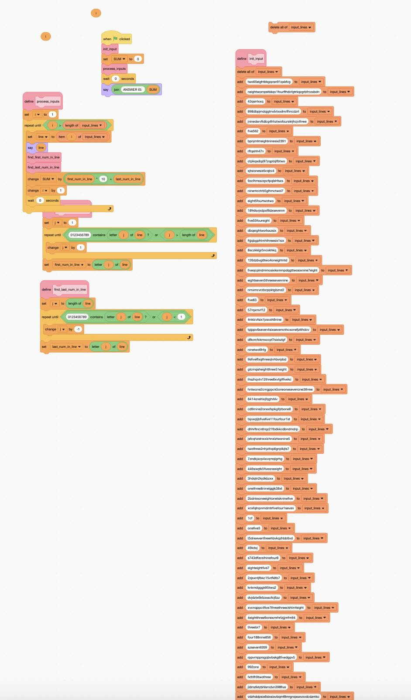
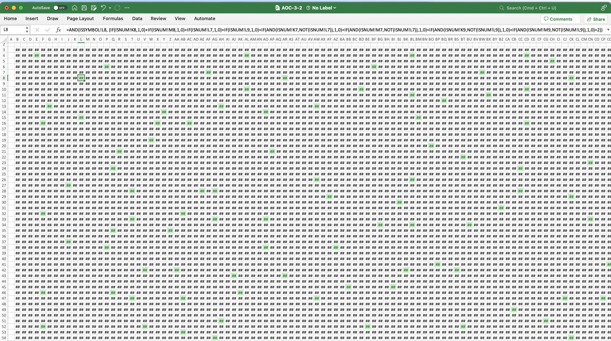
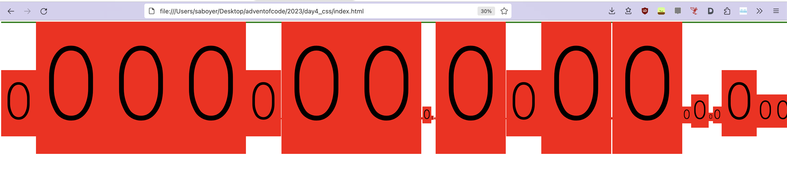
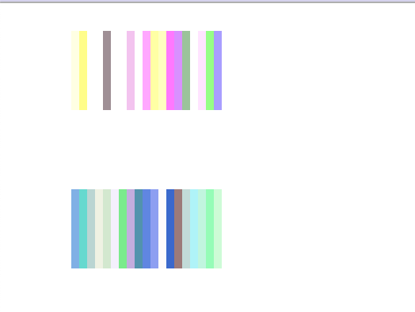

# Avent of Code 2023 - language zoo 🦒🦏🦓

# Rules

- Complete part 1 of each day in a different language.
  - _What counts as a new language?_
    - Using a 'superset language' (C++) but not using its new features doesn't count.
    - Languages that _can_ be compiled to another language (e.g. typescript to javascript), do count (mainly cause I want to try typescript)
    - Not allowed to write code in one language and transpile it to another.
- Other languages can be used to transform the program input, if necessary.

- Part 2 can be completed in any language, or just skipped (I would like to have some free time this month)

# Language Log

| Day | Language                                  | On the `n`th day of Christmas, saboyer gave to me |
| --- | ----------------------------------------- | ----------- |
| 1   | [Scratch (MIT)](https://scratch.mit.edu/) | 1059 blocks |
| 2   | [PostgreSQL](https://www.postgresql.org/)  | 12 SELECTs  |
| 3   | [Microsoft Excel](https://www.microsoft.com/en-gb/microsoft-365/excel) (not VBScript/Python)| 252,340 formula cells |
| 4   | [CSS](https://developer.mozilla.org/en-US/docs/Web/CSS) | 597 selectors  |
| 5   | [GLSL Fragment Shader](https://www.khronos.org/opengl/wiki/Fragment_Shader) | 100,80 texture() lookups  |
| 6   | [Desmos Graphing Calculator](https://www.desmos.com/calculator/rxfzqlgozn) | 5 expressions  |
| 7   | [Haskell](https://haskell.org) | 28 pattern matches  |
| 8   | [Bash](https://www.gnu.org/software/bash/manual/) | 2m 3s runtime (for part 1 😬) |

# Gallery

_Day 1 (Scratch) - a Python script generated blocks for the input._

---

_Day 3 (Excel) - A grid of formulae propagate boolean values through the sheets._

---

_Day 4 (CSS) - The character '0' is recursively doubled in size based on the presence of input elements._

---

_Day 5 (GLSL) - Input seeds and almanac ranges are converted to 2D textures; seed positions are 'rendered' on the GPU._

---

